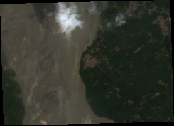
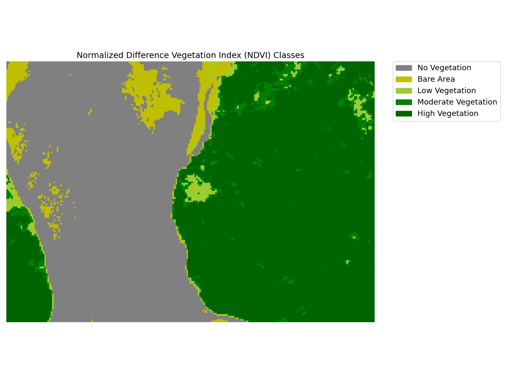
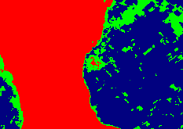
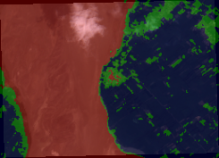

# Vegetation-health-report

Use this repo to generate vegetation health reports for the input AOI (Area of Interest) geojson or shapefile.  
Input AOI --> generates NDVI --> performs kmeans clustersing --> generates PDF report.

### Features
 - Uses cloud optimized GeoTIFF (COG) format to avoid downloading large files onto your local machine
 - Option to provide start date and end date
 - Automatically calculates ideal no. of clusters (kmeans) using )
 - Generates an interactive folium map (html) with identified clusters
 - For each available date, generates a pdf report containing RGB, NDVI, NDVI classes, Kmeans clusters, and clusters superimposed on RGB
 -  can be used as an independent module with options to specify data source (sentinel, landsat, etc.), bands, cloud threshold, etc.
 - Applies a precautionary buffer of radius=0 at input AOI, to make sure polygons are valid
  

### Sample results for a 
 </img>
 </img>
 </img>
 </img>
 </img>  

 

### Usage
Run the script main.py and pass the following arguments:  
- "--aoi": path to aoi vector file (geojson or shapefile)
- "--clusters" [optional]: Number of clusters desired in output. Will auto compute ideal no. of clusters if left blank
- "--start_date" [optioanl]: start date in YYYY-MM-DD format. Will take today's date if left blank
- "--end_date" [optional]: end date in YYYY-MM-DD format. Will take today's date if left blank
- "--out_dir" [optional]:path to directory where data will be generated
- "--crs" [optional]: target CRS of the generated data. If skipped, CRS will match input aoi's CRS
- "--cloud_threshold" [optional]: Cloud cover threshold in %. If skipped, the default value is set to 5  
Example 1: `python main.py --aoi resources/test_aoi_river.geojson`  
Example 2: `python main.py --aoi resources/test_aoi_river.geojson --start_date 2021-08-17 --clusters 3 --cloud_threshold 15`
 

### Installation
These steps are for Ubuntu (might differ a bit for MacOS and Windows)
Ensure that GDAL is installed in your environment. See  for gdal's installation instructions.  
Step 1: Clone the repo --> `git clone https://github.com/seedlit/vegetation-health-report.git`  
Step 2: move into the repo --> `cd vegetation-health-report`  
Step 3: Create a new virtual environment --> `python3 -m venv venv`  
Step 4: Activate the virtual environment --> `source venv/bin/activate`  
Step 5: Install the dependencies --> `pip install -r requirements.txt`  
Step 6: Run tests --> `python test.py`
 

### TODO:
- [ ] remove dependency on gdal. Most of the gdal's functions that I am using can be completed by rastertio or some other library. This would help in creating a pypi package for this repo
- [ ] create a package - conda or pypi
- [ ] Incorporate the generated folium maps in generated pdf report (as screeshots)
- [ ] Degub cloud cover checks issue: the cloud cover threshold doesen't seems to be working
- [ ] Use multiprocessing to speed up
- [ ] Make async. For example, no need to wait for data to get downloaded for all dates. Start wokring as soon as data is downloaded for a date. And remaining downloading can continue in background
