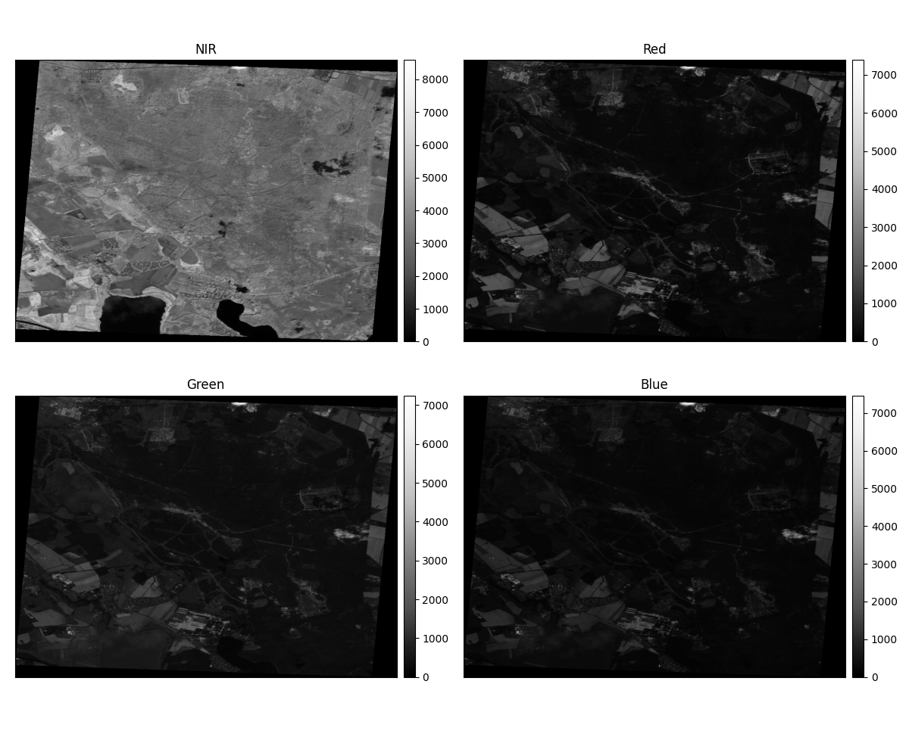
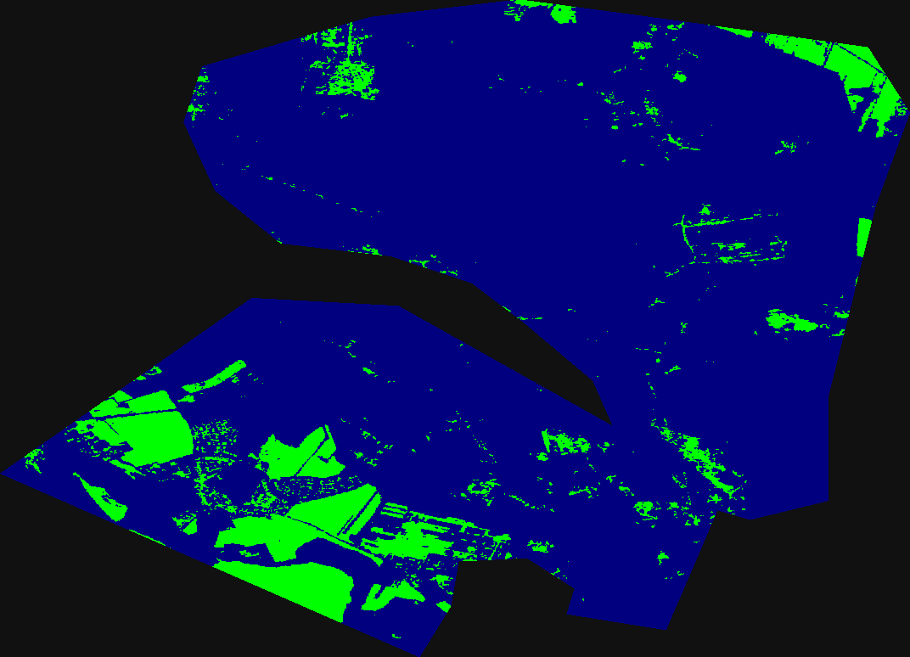

# Exploratory Data Analysis

The data is downloaded using the [Element84 API](https://www.element84.com/earth-search/).  
For each AOI, 4 bands from Sentinel 2 are downloaded --> NIR (B08), Red (B04), Green (B03), Blue (B02)  

 </img>
 

The data is in Float32 format. Just for the purpose of visualizing RGB, the R,G,B bands are converted to uint8 format.

 </img>
 

## AOI
For a given AOI (geojson or shapefile), a precautionary buffer of radius=0 is applied to get rid of invalid geometries like self-intersecting polygons. Given AOI is outline of *Döberitzer Heide*, a nature reserve just outside of Berlin.

 </img>
 

## NDVI
For computing NDVI, bands NIR and Red are used.  
[The formula for NDVI is](https://en.wikipedia.org/wiki/Normalized_difference_vegetation_index): (NIR - R)/(NIR + R)   
Theorotically, NDVI can vary between -1 to +1. Higher NDVI values means higher density of green vegetation. Low NDVI values indicate moisture-stressed vegetation or no vegetation at all.  

 </img>
 

For better understanding, the NDVI is further classified into 5 categories with ndvi_class_bins = [-1, 0, 0.1, 0.25, 0.4, 1]  
categories = ["No Vegetation", "Bare Area", "Low Vegetation", "Moderate Vegetation", "High Vegetation"]  
For this AOI, most of the area has moderate to high vegetation (as of 2021-08-14)

 </img>
 

## Clustering
Clustering ([kmeans](https://scikit-learn.org/stable/modules/generated/sklearn.cluster.KMeans.html)) is also performed on computed NDVI array.  
For kmeans clustering algorithm, the number of clusters also need to be provided as an input.  
This can be tricky as estimating the ideal number of clusters might require some domain knowledge.  
But there are some mathemetical methods to determine the ideal number of clusters. One such method used in this repo is [Elbow curve Method](https://www.oreilly.com/library/view/statistics-for-machine/9781788295758/c71ea970-0f3c-4973-8d3a-b09a7a6553c1.xhtml)  

From the source:
> The elbow method is used to determine the optimal number of clusters in k-means clustering. The elbow method plots the value of the cost function produced by different values of k. As you know, if k increases, average distortion will decrease, each cluster will have fewer constituent instances, and the instances will be closer to their respective centroids. However, the improvements in average distortion will decline as k increases. The value of k at which improvement in distortion declines the most is called the elbow, at which we should stop dividing the data into further clusters.

 
For better visualization, the clustered array (2D) is converted to RGB (3D).  
Finally, the clustered image is superimposed on RGB to get a sense of ground reality, and whether the clustered classes align with ground truth or not.

 </img>
 

 </img>
 

## Interactive Folium Maps
The clustered image is polygonized, and converted into a vector file (geojson or shapefile).
Depending on the data, these vector formats are often much smaller in size and easier to share. However, unlike rasters, they require some specialised softwares (like [QGIS](https://qgis.org/en/site/)) to visualize.  
These vector formats further allow the possibility of some vector post-processing like simplification ([Ramer–Douglas–Peucker algorithm](https://en.wikipedia.org/wiki/Ramer%E2%80%93Douglas%E2%80%93Peucker_algorithm)). Hence the results are more soothing to eyes and of great reduction in storage size.

 </img>
 
